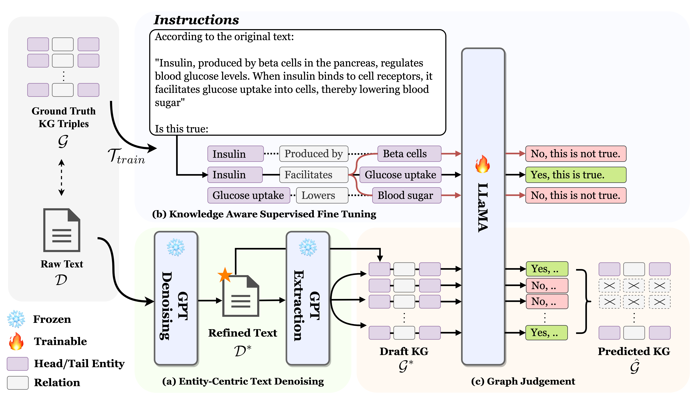

# Can LLMs be Good Graph Judge for Knowledge Graph Construction?

This is the repo for the paper [Can LLMs be Good Graph Judge for Knowledge Graph Construction?](https://arxiv.org/abs/2411.17388). <a href="https://github.com/hhy-huang/GraphJudge" target="_blank">
    
</a>

LoRA weights have been released: 🤗 <a href="https://huggingface.co/HaoyuHuang2/graphjudger" target="_blank">Hugging Face</a>.




## Project Structure
```
.
├── README.md
├── .gitignore
├── LICENSE
├── chat
│   ├── run_chatgpt_entity.py
│   ├── run_chatgpt_triple.py
│   ├── run_chatgpt_gj.py
│   └── run_chatgpt.py
├── datasets
│   ├── GPT4o_mini_result_GenWiki-Hard
│   ├── GPT4o_mini_result_rebel_sub
│   ├── GPT4o_mini_result_SCIERC
│   ├── prepare_KGCom.ipynb
│   └── process_data.ipynb
├── graph_evaluation
│   ├── metrics
│   │   ├── eval.py
│   │   └── graph_matching.py
│   └── eval.sh
├── graphjudger
│   ├── data
│   │   ├── genwiki
│   │   ├── rebel_sub
│   │   └── scierc
│   ├── models
│   │   └── {your lora weights here}
│   ├── bert_classifier_finetune.py
│   ├── bert_classifier_infer.py
│   ├── lora_finetune_genwiki_context.py
│   ├── lora_finetune_rebel_context.py
│   ├── lora_finetune_scierc_context.py
│   ├── lora_infer_batch_case_gj.py
│   ├── lora_infer_batch_naive.py
│   ├── lora_infer_batch.py
│   └── lora_infer.py
└── img
    ├── graphjudger_context.drawio.png
    └── icon.png
```

## Guidance 

Coming soon.

## Cite Us
```
@misc{huang2025llmsgoodgraphjudge,
      title={Can LLMs be Good Graph Judge for Knowledge Graph Construction?}, 
      author={Haoyu Huang and Chong Chen and Zeang Sheng and Yang Li and Wentao Zhang},
      year={2025},
      eprint={2411.17388},
      archivePrefix={arXiv},
      primaryClass={cs.CL},
      url={https://arxiv.org/abs/2411.17388}, 
}
```
