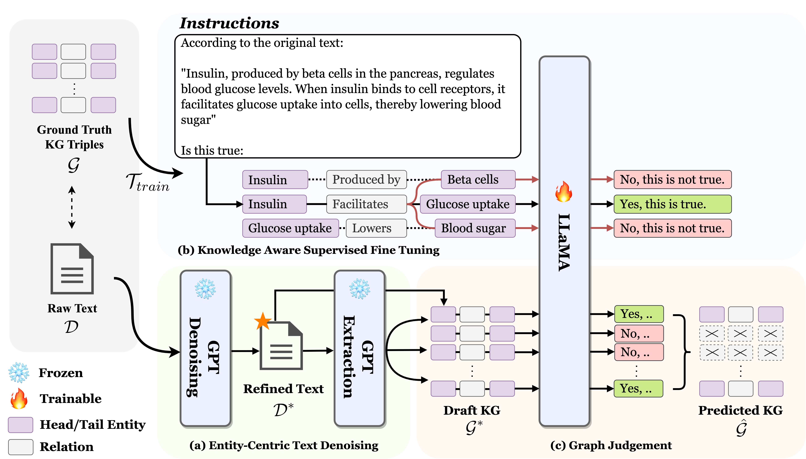

# Can LLMs be Good Graph Judge for Knowledge Graph Construction?

This is the repo for the paper [Can LLMs be Good Graph Judge for Knowledge Graph Construction?](https://arxiv.org/abs/2411.17388). <a href="https://github.com/hhy-huang/GraphJudge" target="_blank">
    
</a>

LoRA weights have been released: 🤗 <a href="https://huggingface.co/HaoyuHuang2/graphjudger" target="_blank">Hugging Face</a>.

## News
- Released streamlit pipeline of graphjudge: [GraphJudge_TextToKG_Pipeline](https://github.com/CongJie-Pan/GraphJudge_TextToKG_Pipeline), thanks to the community!
- **Accepted to [EMNLP 2025](https://2025.emnlp.org/) Main Conference! 🎉**




## Project Structure
```
.
├── README.md
├── .gitignore
├── LICENSE
├── chat
│   ├── run_chatgpt_entity.py
│   ├── run_chatgpt_triple.py
│   ├── run_chatgpt_gj.py
│   └── run_chatgpt.py
├── datasets
│   ├── GPT4o_mini_result_GenWiki-Hard
│   ├── GPT4o_mini_result_rebel_sub
│   ├── GPT4o_mini_result_SCIERC
│   ├── prepare_KGCom.ipynb
│   └── process_data.ipynb
├── graph_evaluation
│   ├── metrics
│   │   ├── eval.py
│   │   └── graph_matching.py
│   └── eval.sh
├── graphjudger
│   ├── data
│   │   ├── genwiki
│   │   ├── rebel_sub
│   │   └── scierc
│   ├── models
│   │   └── {your lora weights here}
│   ├── bert_classifier_finetune.py
│   ├── bert_classifier_infer.py
│   ├── lora_finetune_genwiki_context.py
│   ├── lora_finetune_rebel_context.py
│   ├── lora_finetune_scierc_context.py
│   ├── lora_infer_batch_case_gj.py
│   ├── lora_infer_batch_naive.py
│   ├── lora_infer_batch.py
│   └── lora_infer.py
└── img
    ├── graphjudger_context.drawio.png
    └── icon.png
```

## Guidance 

## Files Introduction
1. `datasets` contains the used datasets and `prepare_KGCom.ipynb` to "Generate Instruction for Graph Judgement", "Generate test data for Graph Judgement" and "Filter the generated graphs with Judgement result".
2. `graph_evaluation` contains the graph evaluation metrics.
3. `chat`contains the sctipts to prompt naive LLMs.
4. `graph_judger` contains the SFT and inference sctipts.


## Guidance 

### ECTD

Run:

```shell
python ./chat/run_chatgpt_entity.py
```

Get the denoised text data and entities. Don't forget to change the iteration parameters in the codes (We can do that iteratively to improve the performance). The results are under `./datasets/GPT4o_mini_result_{dataset}/Iteration{i}`. 

Then Run:

```shell
python ./chat/run_chatgpt_triple.py
```

Get the generated KG with denoised text data and entities under `./datasets/GPT4o_mini_result_{dataset}/Graph_Iteration{i}`.

### KASFT

Then you need to employ SFT on the task of graph judgement with your training data `./datasets/GPT4o_mini_result_{dataset}/train.source` and your generated graph `./datasets/GPT4o_mini_result_{dataset}/Graph_Iteration{i}/test_generated_graphs.txt`. Then you need to generate the training instructions in `./datasets/GPT4o_mini_result_{dataset}/prepare_KGCom.ipynb`. You can finish training instructions generation, test data generation and triple filtering here.

So for graph judgement tasks, you need to firstly run the first cell in `./datasets/prepare_KGCom.ipynb`, getting the instruction data `./datasets/GPT4o_mini_result_{dataset}/train_instructions_llama.json`. Then put that in `./graph_judger/data/{dataset}`, and then Run:

```shell
cd ./graph_judger
python lora_finetune_{dataset}_context.py
```

Then we can get the fine-tuned model in `./graph_judger/models/`. Then run the second cell of `./datasets/prepare_KGCom.ipynb` to generate test data from generated triples. And move that under `./graph_judger/data/{dataset}`, which is `test_instructions_context_llama2_7b_itr{i}.csv`. Put that under `./graph_judger/data/{dataset}`. Then Run:

```shell
cd ./graph_judger
python lora_infer_batch.py
```

Then we can get the judging result for every triple we generated, which is `pred_instructions_context_llama2_7b_itr{i}.csv`. Put that under `./datasets/GPT4o_mini_result_{dataset}/Graph_Iteration{i}`. 

### GJ
Then run the third cell of `./datasets/prepare_KGCom.ipynb` to remove inaccurate the triples in `./datasets/GPT4o_mini_result_{dataset}/Graph_Iteration{i}/test_generated_graphs_final.txt` with the label we predicted in `pred_instructions_context_llama2_7b_itr{i}.csv`. Then we will get the final result of our method `./datasets/GPT4o_mini_result_{dataset}/Graph_Iteration{i}/test_generated_graphs_final.txt`.

For evaluation, modify the path in `./graph_evaluation/eval.sh` to evaluate the result. Don't forget to put the Bert model under `./graph_evaluation/`.

```shell
cd ./graph_evaluation
bash eval.sh
```

For naive LLM baselines, Run:

```shell
python ./chat/run_chatgpt.py
```

## Cite Us
```python
@misc{huang2025llmsgoodgraphjudge,
      title={Can LLMs be Good Graph Judge for Knowledge Graph Construction?}, 
      author={Haoyu Huang and Chong Chen and Zeang Sheng and Yang Li and Wentao Zhang},
      year={2025},
      eprint={2411.17388},
      archivePrefix={arXiv},
      primaryClass={cs.CL},
      url={https://arxiv.org/abs/2411.17388}, 
}
```
